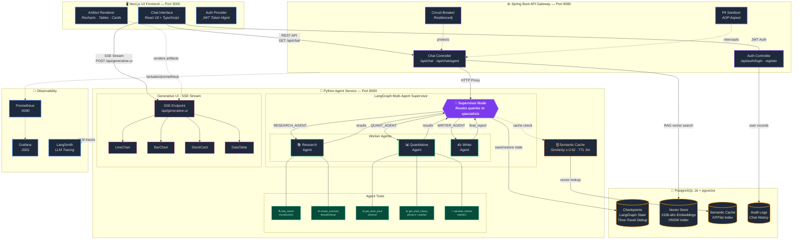

# System Architecture — Enterprise Financial Agent

```mermaid
graph TB
    %% ── Styling ──
    classDef frontend fill:#1E293B,stroke:#3B82F6,stroke-width:2px,color:#E2E8F0
    classDef backend fill:#1E293B,stroke:#8B5CF6,stroke-width:2px,color:#E2E8F0
    classDef supervisor fill:#7C3AED,stroke:#A78BFA,stroke-width:2px,color:#F5F3FF,font-weight:bold
    classDef agent fill:#1E293B,stroke:#10B981,stroke-width:2px,color:#E2E8F0
    classDef tool fill:#064E3B,stroke:#34D399,stroke-width:1px,color:#D1FAE5,font-size:11px
    classDef db fill:#1E293B,stroke:#F59E0B,stroke-width:2px,color:#FEF3C7
    classDef cache fill:#1E293B,stroke:#F97316,stroke-width:1px,color:#FED7AA
    classDef stream fill:#1E293B,stroke:#EC4899,stroke-width:1px,color:#FBCFE8

    %% ══════════════════════════════════════
    %% FRONTEND LAYER
    %% ══════════════════════════════════════
    subgraph FRONTEND["🖥️  Next.js 14 Frontend  —  Port 3000"]
        direction LR
        UI["Chat Interface<br/><i>React 18 + TypeScript</i>"]
        AR["Artifact Renderer<br/><i>Recharts · Tables · Cards</i>"]
        AUTH["Auth Provider<br/><i>JWT Token Mgmt</i>"]
    end

    %% ══════════════════════════════════════
    %% API GATEWAY LAYER
    %% ══════════════════════════════════════
    subgraph GATEWAY["☕  Spring Boot API Gateway  —  Port 8080"]
        direction LR
        CHAT_CTRL["Chat Controller<br/><i>/api/chat · /api/chat/agent</i>"]
        AUTH_CTRL["Auth Controller<br/><i>/api/auth/login · register</i>"]
        PII["PII Sanitizer<br/><i>AOP Aspect</i>"]
        CB["Circuit Breaker<br/><i>Resilience4j</i>"]
    end

    %% ══════════════════════════════════════
    %% AGENT LAYER — THE CORE
    %% ══════════════════════════════════════
    subgraph AGENT["🐍  Python Agent Service  —  Port 8000"]
        direction TB

        subgraph SUPERVISOR_BOX["  LangGraph Multi-Agent Supervisor  "]
            direction TB
            SUP{{"🧠 Supervisor Node<br/><i>Routes queries to specialists</i>"}}

            subgraph WORKERS["  Worker Agents  "]
                direction LR
                RES["📚 Research<br/>Agent"]
                QUANT["📊 Quantitative<br/>Agent"]
                WRITER["✍️ Writer<br/>Agent"]
            end

            SUP -->|"RESEARCH_AGENT"| RES
            SUP -->|"QUANT_AGENT"| QUANT
            SUP -->|"WRITER_AGENT"| WRITER
            RES -->|results| SUP
            QUANT -->|results| SUP
            WRITER -->|"final_report"| SUP
        end

        subgraph TOOLS["  Agent Tools  "]
            direction LR
            T1["🔍 web_search<br/><i>DuckDuckGo</i>"]
            T2["🌐 scrape_summary<br/><i>BeautifulSoup</i>"]
            T3["💹 get_stock_price<br/><i>yfinance</i>"]
            T4["📈 get_stock_history<br/><i>yfinance + pandas</i>"]
            T5["🔢 calculate_metrics<br/><i>statistics</i>"]
        end

        RES --- T1
        RES --- T2
        QUANT --- T3
        QUANT --- T4
        QUANT --- T5

        subgraph SSE_STREAM["  Generative UI · SSE Stream  "]
            direction LR
            GEN["SSE Endpoint<br/><i>/api/generative-ui</i>"]
            ART1["LineChart"]
            ART2["BarChart"]
            ART3["StockCard"]
            ART4["DataTable"]
            GEN --> ART1
            GEN --> ART2
            GEN --> ART3
            GEN --> ART4
        end

        SCACHE["🗄️ Semantic Cache<br/><i>Similarity ≥ 0.92 · TTL 5m</i>"]
    end

    %% ══════════════════════════════════════
    %% DATABASE LAYER
    %% ══════════════════════════════════════
    subgraph DATABASE["🐘  PostgreSQL 16 + pgvector"]
        direction LR
        CP[("Checkpoints<br/><i>LangGraph State</i><br/><i>Time-Travel Debug</i>")]
        VS[("Vector Store<br/><i>1536-dim Embeddings</i><br/><i>HNSW Index</i>")]
        SC[("Semantic Cache<br/><i>IVFFlat Index</i>")]
        AUDIT[("Audit Logs<br/><i>Chat History</i>")]
    end

    %% ══════════════════════════════════════
    %% MONITORING LAYER
    %% ══════════════════════════════════════
    subgraph MONITORING["📡  Observability"]
        direction LR
        PROM["Prometheus<br/><i>:9090</i>"]
        GRAF["Grafana<br/><i>:3001</i>"]
        LS["LangSmith<br/><i>LLM Tracing</i>"]
    end

    %% ══════════════════════════════════════
    %% CONNECTIONS
    %% ══════════════════════════════════════

    %% Frontend → Gateway
    UI -->|"REST API<br/>GET /api/chat"| CHAT_CTRL
    UI -->|"SSE Stream<br/>POST /api/generative-ui"| GEN
    UI ---|"JWT Auth"| AUTH_CTRL
    AR -.->|"renders artifacts"| GEN

    %% Gateway → Agent
    CHAT_CTRL -->|"HTTP Proxy"| SUP
    CB -.->|"protects"| CHAT_CTRL
    PII -.->|"intercepts"| CHAT_CTRL

    %% Agent → Database
    SUP -->|"save/restore state"| CP
    SCACHE -->|"vector lookup"| SC
    SUP -.->|"cache check"| SCACHE

    %% Gateway → Database
    CHAT_CTRL -->|"RAG vector search"| VS
    AUTH_CTRL -->|"user records"| AUDIT

    %% Monitoring
    GATEWAY -.->|"/actuator/prometheus"| PROM
    PROM -.-> GRAF
    AGENT -.->|"LLM traces"| LS

    %% ── Apply Styles ──
    class UI,AR,AUTH frontend
    class CHAT_CTRL,AUTH_CTRL,PII,CB backend
    class SUP supervisor
    class RES,QUANT,WRITER agent
    class T1,T2,T3,T4,T5 tool
    class CP,VS,SC,AUDIT db
    class SCACHE cache
    class GEN,ART1,ART2,ART3,ART4 stream
    class PROM,GRAF,LS frontend
```
